# Aegis Fusion

A DevSecOps security automation tool. It runs five open-source scanners against a project, converts their very different outputs into one common format, applies a written policy to decide pass or fail, writes JSON and Markdown reports, and enforces the result in GitHub Actions, so a change that fails the scan cannot be merged.

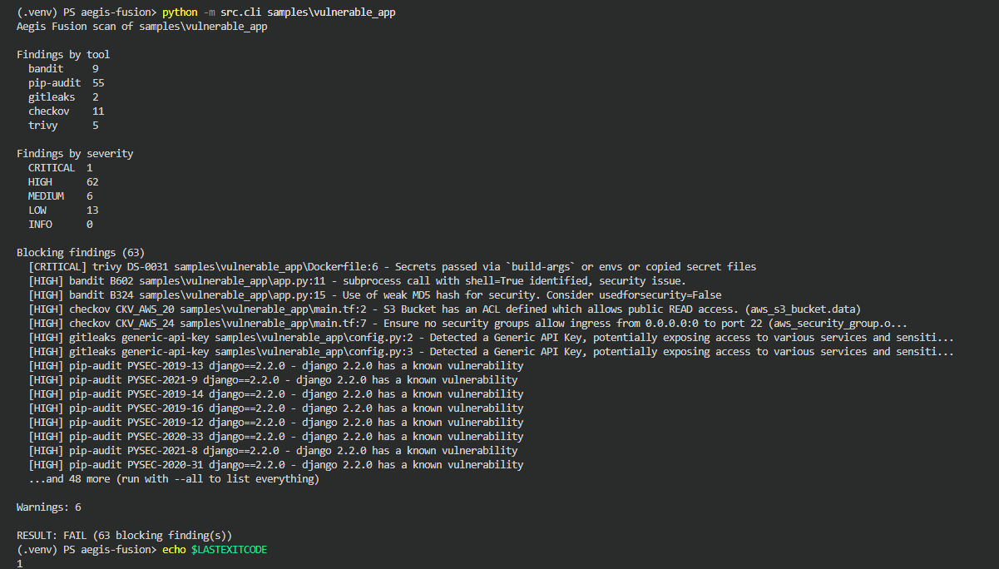

*One command, five scanners, one verdict. The exit code is what CI uses as the gate.*

## What it scans

| Scanner | Looks for | Runs on |
|---|---|---|
| [Bandit](https://github.com/PyCQA/bandit) | Insecure Python code | Source files |
| [pip-audit](https://github.com/pypa/pip-audit) | Dependencies with known vulnerabilities | `requirements.txt` |
| [Gitleaks](https://github.com/gitleaks/gitleaks) | Hardcoded secrets | Any file |
| [Checkov](https://github.com/bridgecrewio/checkov) | Terraform misconfigurations | `.tf` files |
| [Trivy](https://github.com/aquasecurity/trivy) | Dockerfile misconfigurations and vulnerable image packages | Dockerfiles, container images |

Gitleaks, Checkov, and Trivy run in Docker, so nothing else needs installing.

## Quick start

Requires Python 3.14 (what I develop and test on) and Docker.

```powershell
git clone https://github.com/FCortezSecurity/aegis-fusion.git
cd aegis-fusion
python -m venv .venv
.\.venv\Scripts\Activate.ps1      # Linux/macOS: source .venv/bin/activate
pip install -r requirements.txt
```

Scan the included sample, which is intentionally vulnerable:

```powershell
python -m src.cli samples/vulnerable_app
```

Options:

| Flag | Effect |
|---|---|
| `--json PATH` | Write a machine-readable JSON report |
| `--markdown PATH` | Write a human-readable Markdown report |
| `--image NAME` | Also scan a container image, e.g. `python:3.8-slim` |
| `--policy PATH` | Use a different policy file |
| `--all` | List every blocking finding instead of the first 15 |

The first run pulls the scanner images and Trivy's vulnerability database, so it takes a few minutes.

### Exit codes

| Code | Meaning |
|---|---|
| `0` | Policy satisfied |
| `1` | Policy violated: findings at a blocking severity |
| `2` | The scan itself broke (Docker not running, bad policy file, scanner error) |

## How it works

```
scan target
    -> scanners (Bandit, pip-audit, Gitleaks, Checkov, Trivy)
    -> adapters convert each tool's output into a common Finding
    -> policy engine compares findings against configs/policies.yaml
    -> reports (JSON + Markdown) and an exit code
    -> GitHub Actions uses the exit code as the merge gate
```

Every finding is converted into the same shape (`tool`, `rule_id`, `severity`, `title`, `file`, `line`, `fix`) with severity on one scale: CRITICAL, HIGH, MEDIUM, LOW, INFO. Some tools report no severity at all, so the policy file decides.

```yaml
# configs/policies.yaml (excerpt)
thresholds:
  fail_on: [CRITICAL, HIGH]   # any finding at these levels fails the build
  warn_on: [MEDIUM]           # reported, but does not fail the build

severity_map:
  checkov:
    default: MEDIUM
    rules:
      CKV_AWS_24: HIGH        # SSH open to the whole internet
```

### Reports

Dependency vulnerabilities are grouped by package, so Django shows up as one row with 43 advisories instead of 43 lines. The JSON report keeps every finding.

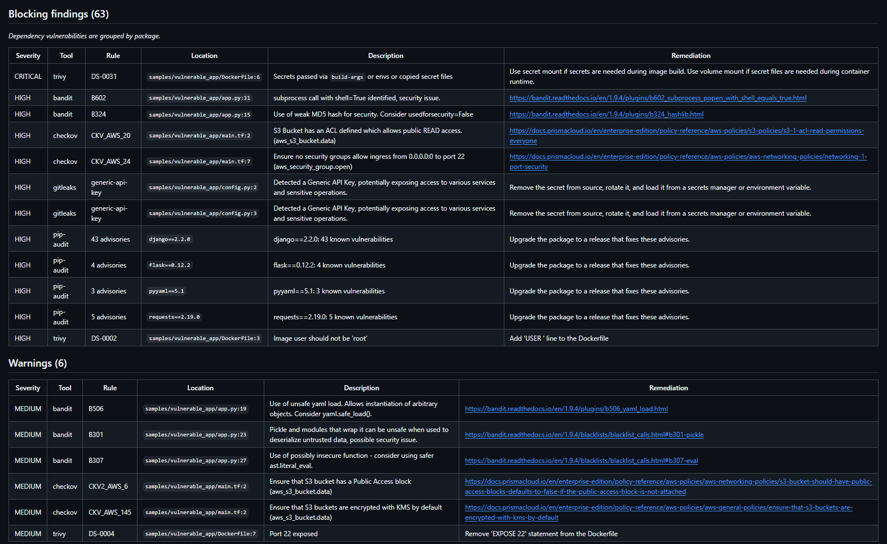

CI writes the reports to the run summary and uploads them as a build artifact on every run, including failed ones.

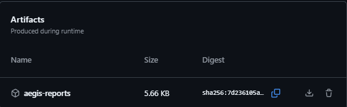

## The CI security gate

Every pull request runs the unit tests and then the scan. A failing scan turns the check red:

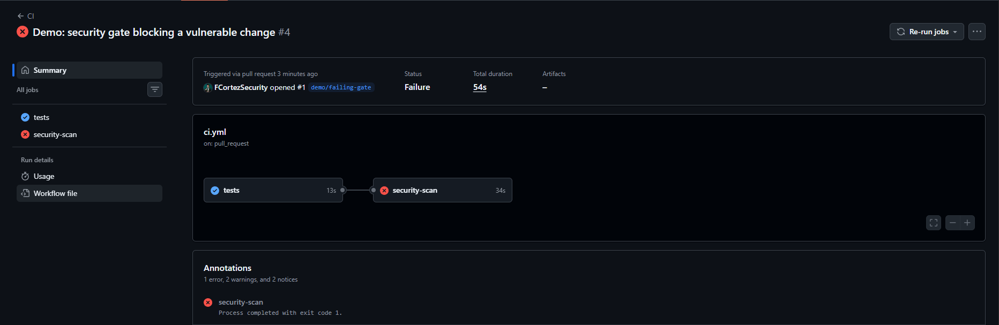

Before I added branch protection, a failing check only warned. The merge button stayed active:

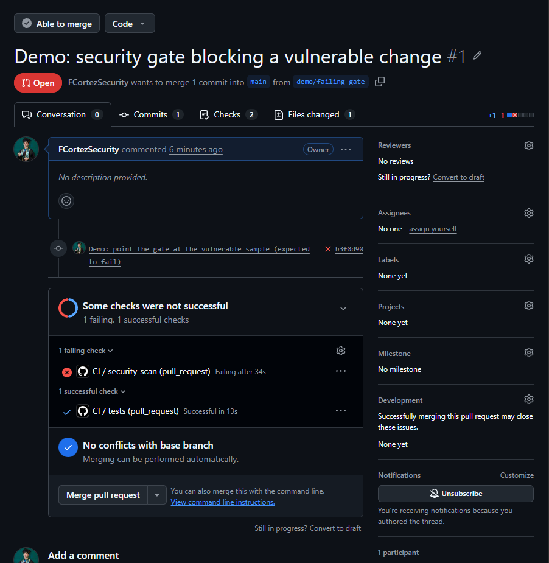

`main` is now protected by a repository ruleset. A pull request needs both `tests` and `security-scan` to pass, and nobody can bypass the rule or push directly to `main`. The same failing check now blocks the merge:

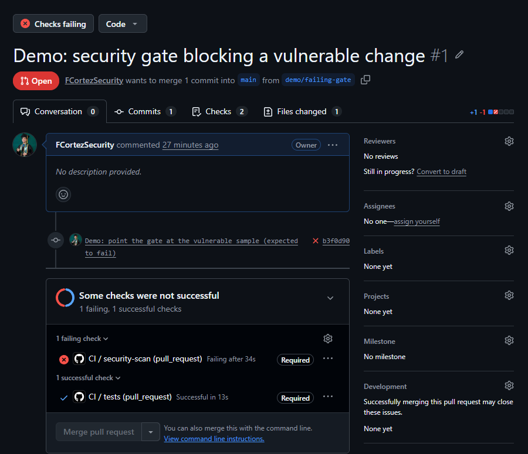

A clean change gets through:

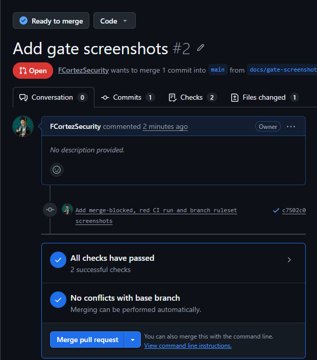

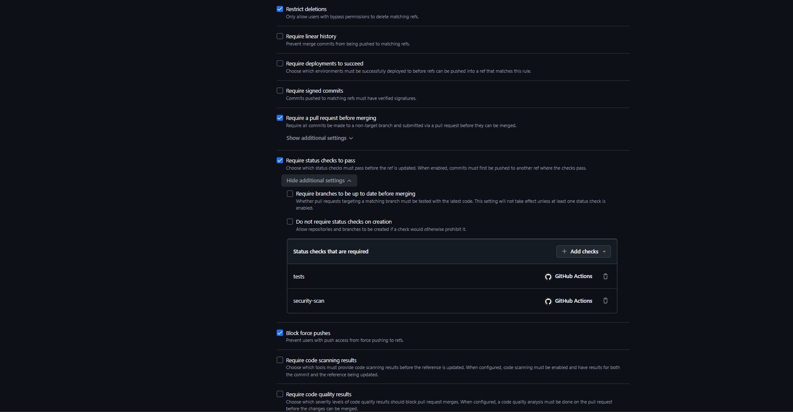

### The gate tests itself

The pipeline scans the project's own code (`src`), which must pass, and then scans `samples/vulnerable_app`, which must fail with exit code 1. If that second scan ever returns 0 or 2, the build fails, because a gate that cannot catch known-bad code gives false confidence.

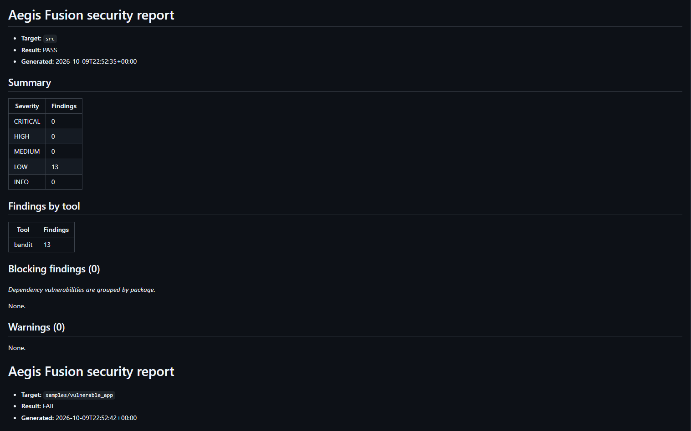

## Design decisions

- **Three exit codes.** A crashed scan must never look like a clean pass or like a security failure. This happened for real: a Docker Hub timeout in CI exited with code 2 instead of silently passing.
- **Fail safe.** An unknown severity label is treated as HIGH, and a typo in the policy thresholds raises an error instead of quietly disabling the gate.
- **Per-tool exit-code handling.** Bandit, pip-audit, Gitleaks, and Checkov exit 1 when they find something. Trivy exits 0 even when it does. Each wrapper treats its tool correctly, and empty output counts as a failure.
- **One format.** Findings are an immutable dataclass that validates its severity. Adapters keep the scanners' quirks out of the policy engine.
- **Severity lives in config.** For tools without severity, the mapping is in `configs/policies.yaml`, not buried in code.
- **Least privilege.** Scanner containers mount the target read-only, Gitleaks output is redacted, the workflow token is read-only, runners are pinned to `ubuntu-24.04`, and image pulls are retried.
- **Pinned scanners.** The three scanner images are pinned by digest in one module (`src/scanners/images.py`), and CI pre-pulls exactly those images, so CI and a laptop run the same scanner versions. Updating a pin is a deliberate pull request.
- **Reports on failure.** Reports are written before the exit code is returned and uploaded with `if: always()`, because failing runs are the ones people need to read.

## Limitations

## Challenges & Fixes

Every one of these was hit for real during this build, not anticipated in advance. Full root-cause detail for each is in [docs/lessons-learned.md](docs/lessons-learned.md).

| Challenge | Root cause | Fix |
|---|---|---|
| The editor refused to save files in the project (`EPERM`) | I had cloned from an Administrator terminal into `C:\Windows\system32`, and moving the folder kept its locked-down permissions | Reset ownership and permissions on the project folder, then worked from a normal terminal in a normal user folder |
| `requirements.txt` showed up in Git as a binary file | Windows PowerShell's `>` redirect writes UTF-16 text | Rewrote the file as plain ASCII |
| A scanner crashed with a confusing JSON error | Bandit uses exit code 1 for "found issues", and a missing install also exited 1, so the wrapper accepted empty output as a result | Empty output now counts as a failure whatever the exit code |
| Gitleaks reported "no leaks" on a sample full of secrets | The sample file was empty because I had not saved it. The scanner was right | Test every scanner against known-bad input before trusting a clean result. The CI self-test now does this on every run |
| Trivy never seemed to fail a scan | Trivy exits 0 even when it finds problems, unlike the other four tools | Treat only a non-zero exit or empty output as failure, and let the policy engine decide pass or fail |
| CI went red with exit code 2 and no findings | Docker Hub timed out while the runner pulled a scanner image | Pre-pull the images with retries, then pin them by digest |
| A failing check still left the Merge button active | A red check is only a warning unless it is marked required | A repository ruleset now requires both checks and a pull request |
| The test suite passed while two scanners were still unpinned | The test inspected `images.py` but not the scanner modules that used the images | Added a test that fails if any scanner module defines its own image |
- **pip-audit reports no severity.** Every advisory defaults to HIGH, so dependency findings dominate the counts. Looking up CVSS scores would fix this.
- **Checkov severities are hand-assigned** in the policy file for the checks seen so far. Everything else defaults to MEDIUM.
- **Scanner images are pinned by digest, but the data behind them is live.** The scanner programs cannot change between runs, but Trivy's vulnerability database and pip-audit's advisories are fetched fresh, so a newly published CVE can turn a passing scan red. That is deliberate. GitHub Actions are pinned by version tag, not commit SHA.
- **Scanner coverage overlaps only partly.** Gitleaks missed the low-entropy `SuperSecret123!` that Bandit caught, which is why several tools run.
- **Narrow scope.** Checkov scans Terraform only, Trivy's config scan covers Dockerfiles only, and the image scan runs on request (`--image`) and not in CI.
- **Not built:** a web dashboard and Windows endpoint telemetry, both optional in my original plan.

## Project layout

```
.github/workflows/ci.yml    CI: tests, security gate, self-test, reports
configs/policies.yaml       thresholds and severity mapping
src/cli.py                  command-line entry point
src/scanners/               one wrapper per scanner
src/normalization/          Finding format and per-tool adapters
src/policy/                 policy loading and pass/fail engine
src/reporting/              JSON and Markdown reports, dependency grouping
tests/unit/                 unit tests (no Docker needed)
samples/vulnerable_app/     intentionally vulnerable scan targets
docs/                       architecture, setup and usage guides
docs/images/                screenshots
```

Run the tests with:

```powershell
python -m pytest tests -v
```

## More documentation

- [Architecture](docs/architecture.md): the layers, how severity is decided, how to add a scanner
- [Setup](docs/setup.md): installation and troubleshooting
- [Usage](docs/usage.md): options, reading the output, changing the policy
- [Lessons learned](docs/lessons-learned.md): the problems I hit, root causes, and fixes
- [Code walkthrough](docs/code-walkthrough.md): the code explained in plain language

## Build log

These early screenshots show each scanner's raw output as I integrated it, before the results were normalized into one format. The current CLI prints the unified report shown at the top of this page.

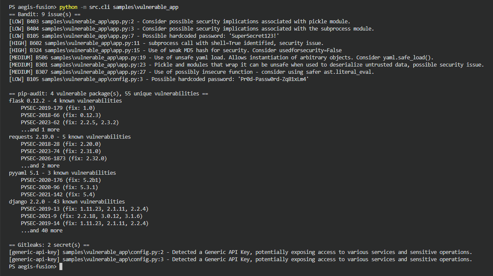

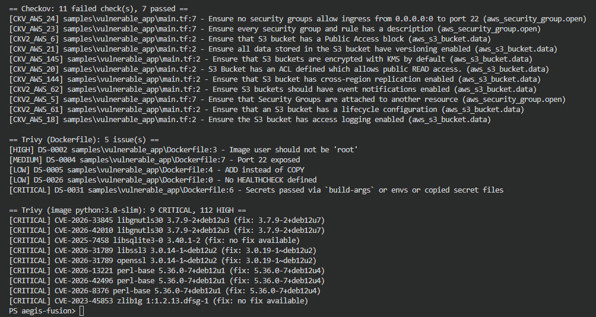

## A note on the samples

Everything in `samples/vulnerable_app` is intentionally insecure and exists only as a scan target. Do not copy that code into real projects or install its dependencies.

## License

MIT